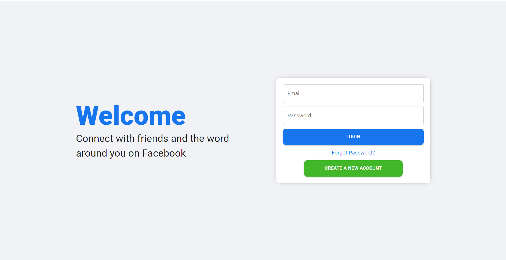

# React Social App✨

## Description

The main goal of the project is to learn about [Material UI](https://mui.com/) and [Socket.io](https://socket.io/) especially to practice Reactjs

## Features

- Use `Material` UI to style the website
- Use `socket.io` to chat, online, offline and display notifications
- Use `react-image-lightbox` to display images
- Use `timeago.js` to format date
- Use `emoji-picker-react` to show emoji
- Use `firebase` to host

## Demo

Link demo: [https://socialapp-73eb8.web.app](https://socialapp-73eb8.web.app/login)
